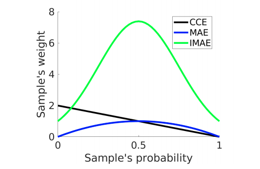
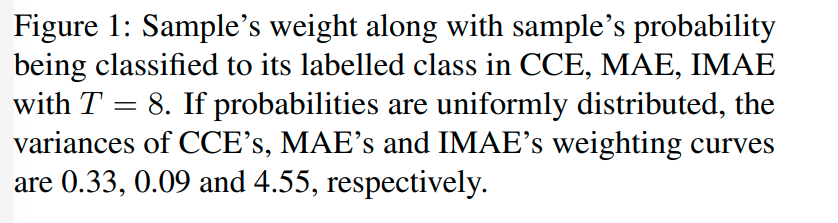
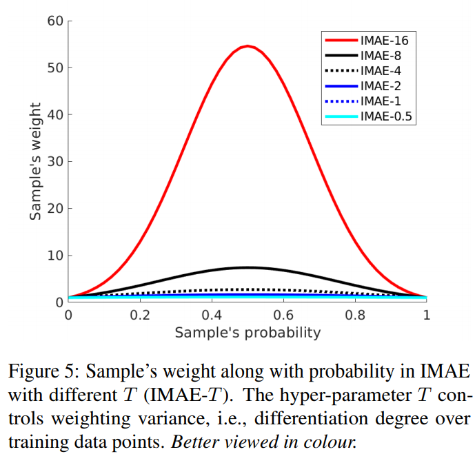

# Improving MAE’s Fitting Ability: Fundamental and Thorough Analysis with A Simple Solution
Project page for [Improving Mean Absolute Error against CCE](https://arxiv.org/pdf/1903.12141.pdf). 


## Introduction

**Research questions:**
* Why does MAE work much worse than CCE although it is noise-robust?
* How to improve MAE against CCE to embrace noise-robustness and high generalisation performance?

Our work is a further study of robust losses following MAE [1] and GCE [2]. They proved MAE is more robust than CCE when noise exists. However, MAE’s underfitting phenomenon is not exposed and studied in the literature. We analysed it thoroughly and proposed a simple solution to embrace both high fitting ability (accurate) and test stability (robust). 

**Our main purpose is not a proposal to push current best performance under label noise.** Instead, we focus on analysing how different losses perform differently and why, which is a fundamental research question. 

Our focus is to analyse why CCE overfits while MAE underfits as presented in ablation studies in Table 2. Under unknown real-world noise in Table 3, we only compared with GCE [2] as it is the most related and demonstrated to be the state-of-the-art.

**IMAE is suitable for cases where inputs and labels may be unmatched.**

Training DNNs requires rethinking data fitting and generalisation.
**Our main contribution is simple analysis and solution from the viewpoint of gradient magnitude with respect to logits.** 

## Takeaways


<p float="left">
  
  
</p>

* By ‘CCE is noise-sensitive and overfits training data’, we mean CCE owns high data fitting accuracy but its final test accuracy drops a lot versus its best test accuracy.
* By ‘MAE is robust’, we mean MAE’s final test accuracy drops only a bit versus its best test one.
* By ‘MAE underfits training data’, we mean its training and best test accuracies are low.

Please see our empirical evidences which can be observed in Table 2 and Figures 3, 4.


**MAE’s fitting ability is much worse than CCE. In other words, CCE overfits to incorrect labels while MAE underfits to correct labels.**
* **The robustness/sensitive to noise is from the angle of test accuracy stability/trend**, i.e., CCE’s final
test accuracy drops a lot versus its best one while MAE’s
final one is almost the same as its best one; 
* **The claim ‘MAE works worse than CCE’ is from the aspect of best test accuracy** since we generally apply early stopping to help
CCE. 

## Results

**Label noise is one of the most explict cases where some observations and their labels are not matched in the training data. In this case, it is quite crucial to make your models learn meaningful patterns instead of errors.**

#### Synthetic noise


#### Real-world unknown noise

**Person video retrieval on MARS [4]**


**Classification on Clothing 1M [5] is coming**

## Hyper-paramter Analysis 




## Citation

Please kindly cite us if you find our work useful.

```
@article{wang2019improving,
  title={Improving {MAE} against {CCE} under Label Noise},
  author={Wang, Xinshao and Kodirov, Elyor and Hua, Yang and Robertson, Neil M},
  journal={arXiv preprint arXiv:1903.12141},
  year={2019}
}
```

## Reference
[1] A. Ghosh, H. Kumar, and P. Sastry. Robust loss functions
under label noise for deep neural networks. In AAAI, 2017.

[2] Z. Zhang and M. R. Sabuncu. Generalized cross entropy loss
for training deep neural networks with noisy labels. In NeurIPS 2018.

[3] C. Zhang, S. Bengio, M. Hardt, B. Recht, and O. Vinyals.
Understanding deep learning requires rethinking generalization.
In ICLR, 2017.

[4] L. Zheng, Z. Bie, Y. Sun, J. Wang, C. Su, S. Wang, and
Q. Tian. Mars: A video benchmark for large-scale person
re-identification. In ECCV, 2016.

[5] Xiao et al. Learning From Massive Noisy Labeled Data for
Image Classification. In CVPR, 2015